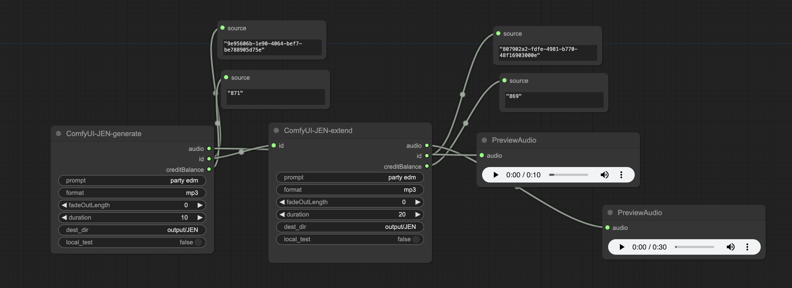

# Comfy-JEN
Comfy UI custom nodes for JEN music generation powered by Futureverse
## Installation
```shell
pip install -r requirements.txt
```
## API Key
You will need API key to run the nodes, no local model required.

### Guides
1. Sign up to https://app.jenmusic.ai/
2. Request API key (feature about to release)
3. Create a config.json file under ComfyUI-JEN, copy and paste your API key in the file and save
```json
{
    "JEN_API_KEY": "YOUR_JEN_API_KEY"
}
```
## Example Workflow
### From track generation to track extend
Generate a 10s track, then extend it by 20s. Generated and extended files are saved under output/JEN or other destinations.

### Download existing track given ID

## License
Apache License Version 2.0

